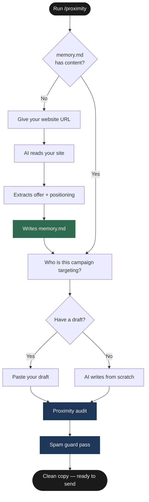

<div align="center">


<br/><br/>

[](./LICENSE)
[](https://claude.ai/code)
[](#skills)
[](https://github.com/termsheetinator)

<br/>

*Brought to you by [InfraSuite](https://infrasuite.io) and Advisory Incubator™*

</div>

---

## What This Is

Two Claude Code skills for cold email copy — built on the Proximity Method.

Most cold email fails before the prospect finishes the first line. Not because the offer is wrong. Because the message feels too far from the result they want. That distance is what the Proximity Method fixes.

**`/proximity`** writes and audits body copy, subject lines, and CTAs using the Proximity Method framework. It onboards from your website on first run — no interview, no setup. Every session after, it just asks who the list is for.

**`/spamguard`** scans any copy against 178+ banned trigger words, 7 phrase categories, and a complete formatting ruleset. Works on emails, subject lines, follow-ups, opener lines, or any copy field. Every violation flagged with a specific fix and a clean rewrite.

---

<div align="center">

</div>

---

## The Proximity Spectrum

Every cold email sits somewhere on this spectrum. The goal is always middle-right — the closest honest framing.

```
◄─────────────────────────────────────────────────────────────────────────►
      FAR LEFT         MIDDLE          MIDDLE-RIGHT        TOO FAR RIGHT
  ─────────────    ─────────────    ─────────────────    ─────────────────
  "We can build    "We run          "We are already      "I have clients
   a system for    campaigns for    speaking to the       ready for you
   you."           companies        kind of buyers        tomorrow."
                   like yours."     you want more of."
  
  ✗ Feels like     ~ Credible,      ✓ Active.            ✗ Unbelievable.
  setup. Heavy.    but about you.   In motion.           Breaks trust.
                                    Target zone.
```

The prospect is always trying to mentally skip ahead to the outcome. Good copy helps them do that. Bad copy forces them to walk backward through your process.

---

## How It Works



---

## Subject Lines

Subject lines are the first conversion event. Treat them as a photograph — not an explanation.

```
THE PHOTOGRAPH PRINCIPLE
━━━━━━━━━━━━━━━━━━━━━━━━━━━━━━━━━━━━━━━━━━━━━━━

 "A picture is worth a thousand words."
  Your subject line should work the same way.

  2-3 words  →  create a photograph
  A photograph  →  is worth a thousand words
  Clarity  >  Curiosity  >  Clever

━━━━━━━━━━━━━━━━━━━━━━━━━━━━━━━━━━━━━━━━━━━━━━━

FORMATS

  {{firstName}} - quick question?
  {{firstName}} - worth a look?
  {{vertical}} demand?
  {{vertical}} dealflow?
  capacity for {{vertical}}s?

RE / FWD LAYER (triggers ongoing-thread recognition)

  {{RANDOM|RE|Re|re|FWD|Fwd|fwd}}: {{firstName}} - worth a look?
  {{RANDOM|RE|Re|re|FWD|Fwd|fwd}} - question {{firstName}}?

RULES

  ✓ 2-4 words maximum
  ✓ Lowercase everything except {{firstName}}
  ✓ Question marks trigger curiosity
  ✓ Add spintax — run 3-4 variants per campaign
  ✗ Never repeat the same first word across sends
```

---

## SpamGuard Coverage

```
WHAT /spamguard SCANS
━━━━━━━━━━━━━━━━━━━━━━━━━━━━━━━━━━━━━━━━━━━━━━━

  178+  banned single words
    7   high-risk phrase categories
         → Money & financial hype
         → Scammy / too-good-to-be-true
         → Marketing overpromises
         → Pressure & clickbait
         → Health & pharma terms
         → Tech phishing-like phrases
         → Gambling, adult & blacklisted
   14   banned follow-up phrases
    1   substitution map (guided rewrites)
    4   formatting checks
         → ALL CAPS
         → Em dashes
         → Multiple exclamation marks
         → Excessive links

━━━━━━━━━━━━━━━━━━━━━━━━━━━━━━━━━━━━━━━━━━━━━━━

Works on: emails · subject lines · follow-ups ·
CTAs · opener lines · LinkedIn DMs · any copy field
```

---

## Install

```bash
curl -fsSL https://raw.githubusercontent.com/termsheetinator/proximity-cold-email/main/install.sh | bash
```

Installs both skills to `~/.claude/skills/`. Creates `memory.md` in your current directory.

Open [Claude Code](https://claude.ai/code) in that directory and run:

```
/proximity
```

First run: give it your website URL. It reads your site and builds your positioning doc.  
Every run after: it asks who the list is for. That is it.

---

## Skills

| Skill | Invoke | What it does |
|---|---|---|
| **Proximity** | `/proximity` | Writes and audits body copy, subject lines, and CTAs using the Proximity Method. Onboards from your website. Remembers your offer across sessions. |
| **SpamGuard** | `/spamguard` | Scans any copy for spam triggers. 178+ banned words, 7 phrase categories, formatting check. Works on any copy field. |

---

## Files

| File | Purpose |
|---|---|
| `proximity.md` | Proximity Method skill — installs to `~/.claude/skills/` |
| `spamguard.md` | SpamGuard skill — installs to `~/.claude/skills/` |
| `memory.md` | Your positioning doc — written on first run, stays in your project directory |
| `install.sh` | Installer — drops both skills in one command |

---

## Requirements

- [Claude Code](https://claude.ai/code) — the CLI for Claude
- An [Anthropic](https://anthropic.com) account

---

<div align="center">

---

**Brought to you by**

[**InfraSuite**](https://infrasuite.io) — Enterprise Grade Cold-Email Mailboxes

**×**

**Advisory Incubator™** — AI & Tech Enabled Advisory

<br/>

*Written and maintained by [Termsheetinator](https://github.com/termsheetinator)*

<br/>

© 2026 Termsheetinator. All rights reserved. — [License](./LICENSE)

</div>
